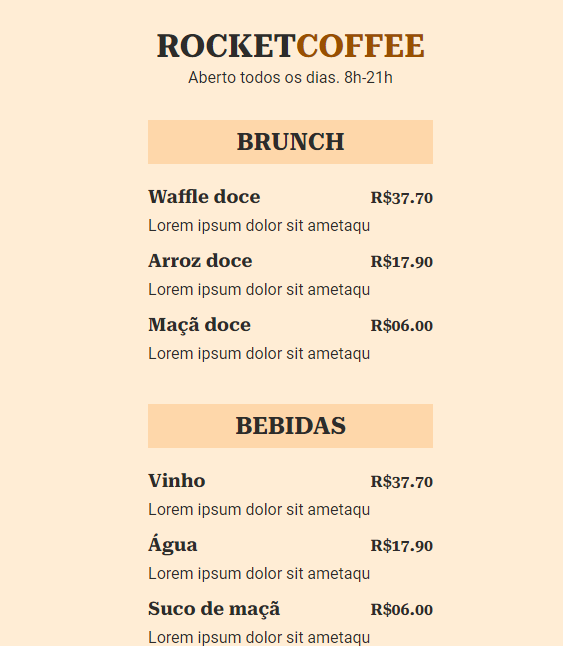

# Maratona Explorer 3.0
## 💻 Project

The objective of this project was to practice HTML and CSS. The project was developed during Rocketseat Maratona Explorer. 
### Technologies & tools

- HTML <a href="https://developer.mozilla.org/pt-BR/docs/Web/HTML" rel="noopener noreferrer">Docs</a>;
- CSS <a href="https://developer.mozilla.org/pt-BR/docs/Web/CSS" rel="noopener noreferrer">Docs</a>;

### Preview

## 🏃‍♂️ Running the project

Clone the repository

Install the live server extension on vscode and press go live.
